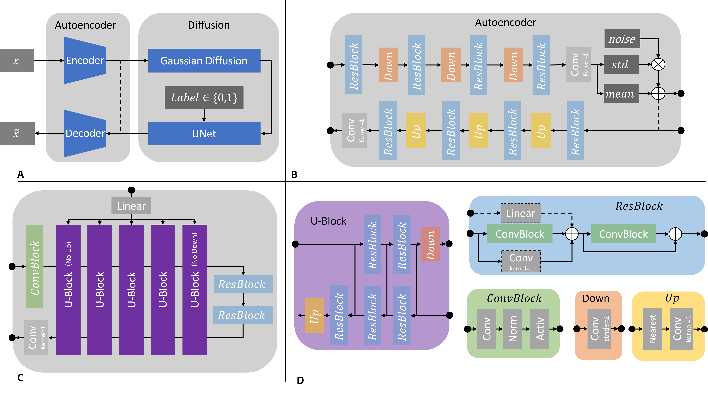
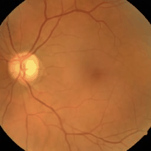

Medfusion - Medical Denoising Diffusion Probabilistic Model 
=============

Paper
=======
Please see: [**Diffusion Probabilistic Models beat GANs on Medical 2D Images**](https://arxiv.org/abs/2212.07501)

*Figure: Medfusion*

  \
*Figure: Eye fundus, chest X-ray and colon histology images generated with Medfusion (Warning color quality limited by .gif)*

Demo
=============
[Link](https://huggingface.co/spaces/mueller-franzes/medfusion-app) to streamlit app.

Install
=============

Create virtual environment and install packages: \
`python -m venv venv` \
`source venv/bin/activate`\
`pip install -e .`

Get Started 
=============

1 Prepare Data
-------------

* Go to [medical_diffusion/data/datasets/dataset_simple_2d.py](medical_diffusion/data/datasets/dataset_simple_2d.py) and create a new `SimpleDataset2D` or write your own Dataset. 

2 Train Autoencoder 
----------------
* Go to [scripts/train_latent_embedder_2d.py](scripts/train_latent_embedder_2d.py) and import your Dataset. 
* Load your dataset with eg. `SimpleDataModule` 
* Customize `VAE` to your needs 
* (Optional): Train a `VAEGAN` instead or load a pre-trained `VAE` and set `start_gan_train_step=-1` to start training of GAN immediately.

2.1 Evaluate Autoencoder 
----------------
* Use [scripts/evaluate_latent_embedder.py](scripts/evaluate_latent_embedder.py) to evaluate the performance of the Autoencoder. 

3 Train Diffusion 
----------------
* Go to [scripts/train_diffusion.py](scripts/train_diffusion.py) and import/load your Dataset as before.
* Load your pre-trained VAE or VAEGAN with `latent_embedder_checkpoint=...` 
* Use `cond_embedder = LabelEmbedder` for conditional training, otherwise  `cond_embedder = None`  

3.1 Evaluate Diffusion 
----------------
* Go to [scripts/sample.py](scripts/sample.py) to sample a test image.
* Go to [scripts/helpers/sample_dataset.py](scripts/helpers/sample_dataset.py) to sample a more reprensative sample size.
* Use [scripts/evaluate_images.py](scripts/evaluate_images.py) to evaluate performance of sample (FID, Precision, Recall)

Acknowledgment 
=============
* Code builds upon https://github.com/lucidrains/denoising-diffusion-pytorch 